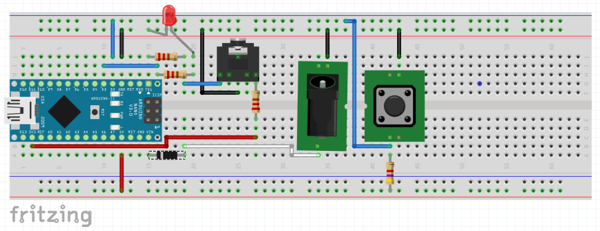

# TapSync
## Tap Tempo for DigiTech JamSync loopers

Tested on Arduino Uno (my test/debug platform) and Arduino Nano Pro (the current final hardware).

### Parts list

* Arduino Pro Nano
* 3x 220ohm resistors
* 1x 4.7kohm resistor
* 1x 1n4001 diode
* 1x 3v red LED
* 1x momentary, normally-open pushbutton foot switch
* 1x 3.5mm TRS audio jack
* 1x 5.5mm (2.1mm inner) power barrel jack
* 1x Hammond 1590A enclosure

### To-do

* second LED for active/clear
* variable measure length
* CV out

### Links

* [Fritzing project](http://fritzing.org/projects/tapsync)
* [Reddit thread](https://www.reddit.com/r/LoopArtists/comments/au44jt/tap_tempo_pedal_for_digitech_jamsync/)
* [FreeStompBoxes.org thread](http://www.freestompboxes.org/viewtopic.php?p=274607#p274607)
